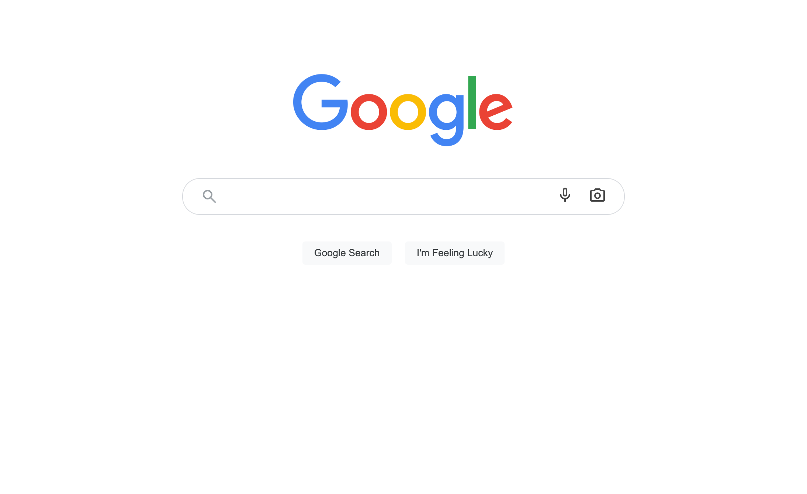
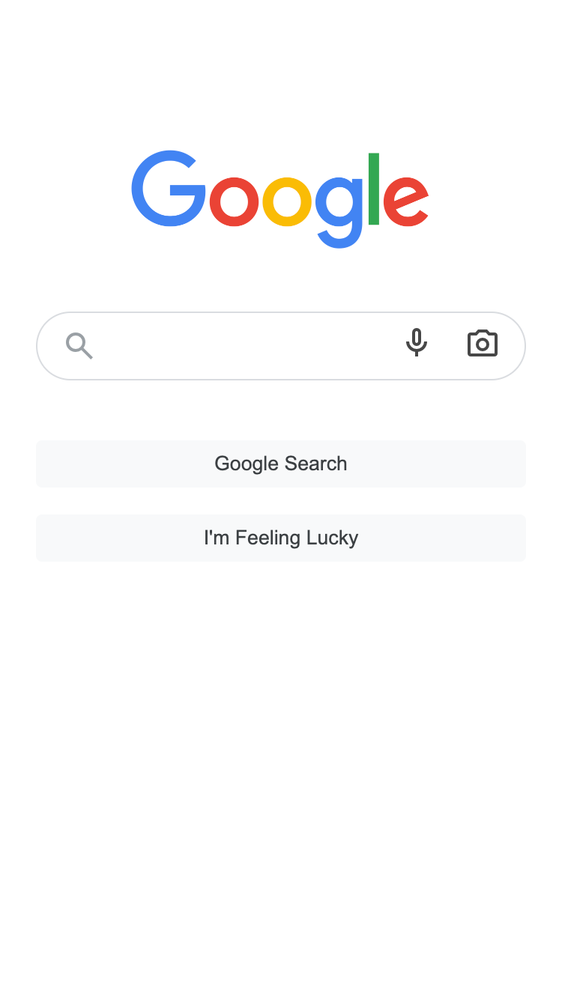

# Google Landing Page Clone

A fun and simple clone of the Google homepage built using HTML and CSS. This project was created to practice front-end layout techniques and mimic a familiar, clean user interface.

## 💻 Features

- Fully responsive layout
- Clean, minimalist design
- Google-style search bar and icons

## 🛠️ Built With

- HTML5
- CSS3

## 📸 Screenshot




## 📸 Screenshots

<table>
  <tr>
    <td align="center">
      
      <br />
      <sub>💻 Desktop View</sub>
    </td>
    <td align="center">
      
      <br />
      <sub>📱 Mobile View</sub>
    </td>
  </tr>
</table>

## 🚀 Getting Started

To run this project locally:

1. Clone the repository:
   ```bash
   git clone https://github.com/camillafdelgado/google-landing-clone.git
   ```
